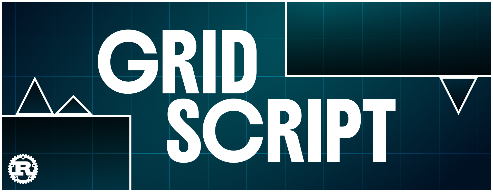

<p align="center">
  
</p>

GridScript is an esoteric programming language designed by
[SuperJedi224](https://esolangs.org/wiki/GridScript). Instead of a linear list of
statements, a GridScript program is a set of **commands placed at coordinates in a
2D space**. A *program tracer* enters at the `START` node, moves in a direction,
and executes whatever nodes it passes through — stopping when it leaves the grid.

The following is a Hello World program:

```
#HELLO WORLD.

@width 4
@height 1

(1,1):START
(3,1):PRINT 'Hello World'
```

The tracer starts at the `START` node `(1,1)` facing east, travels along the row,
enters the node at `(3,1)`, prints `Hello World`, then runs off the east edge of
the 4×1 grid and halts.

## Build and run

```
cargo build --release
```

Run a program by passing its path:

```
cargo run -- examples/factorial.gridscript
```

The CLI takes one script path and one optional flag:

- `<script>` — path to the `.gridscript` file to run (required).
- `--seed <N>` — integer seed for the interpreter's shared random source, used by
  the language's random constructs (`GO RANDOM`, `SWITCH RANDOM`, and so on) and
  by `GOTO` tie-breaking. Overrides an `@seed` in the program metadata.

Program output goes to stdout; warnings and uncaught exceptions go to stderr. The
process exits non-zero on a parse error or an uncaught exception.

## Language tour

Enough to read the samples in `examples/` — the full, authoritative rules live in
[`docs/gridscript_spec.md`](docs/gridscript_spec.md).

**Structure.** A program is a `#TITLE.` line, then `@key value` metadata
(`@width` and `@height` are mandatory), then one node per line as
`(x,y):COMMAND`. A `!!` starts a line comment.

**Nodes and the tracer.** Nodes are open discs of a given `@radius` (default 1)
centered on integer coordinates. The program tracer has a floating-point position
and an integer direction (degrees clockwise from east). Each step it advances one
unit and runs any nodes it crosses, in file order. It halts when it exits the
grid.

**`SWITCH` — conditional control flow.** `SWITCH` rotates
the tracer 90° clockwise when its condition holds, and otherwise leaves it going
straight — so a branch is a node the tracer either turns at or passes through.
Conditions include `SWITCH value`, `SWITCH =value`, `SWITCH !=value`,
`SWITCH >value`, `SWITCH <value`, and `SWITCH RANDOM`.

**`GOTO` and checkpoints.** `CHECKPOINT id` marks a coordinate; `GOTO id`
teleports the tracer to the nearest checkpoint with that id (direction unchanged).
This is how loops are built — see the factorial and truth-machine samples.

**Dataspace and buffer.** State lives in a 2D grid of integers (the *dataspace*),
navigated by a separate *data tracer* (`NEXT VALUE`, `NEXT ROW`, `HOME`, …), plus
a *buffer* that acts as a list/queue (`PUSH`, `REMOVE`, `PEEK`, `SPLIT`,
`SHUFFLE`). Named variables also exist (`STORE`, arithmetic commands).

**Subroutines.** Extra `##NAME.` sections define subroutines with their own
program space, variables, dataspace, and buffer. `CALL name WITH ARGUMENTS …
GIVING var` invokes one synchronously; inside, `INPUT` reads the call's arguments
and `RETURN` hands a value back. The Ackermann sample
(`examples/ackermann.gridscript`) exercises recursion.

Other samples: `truth_machine_1` / `truth_machine_2` (two implementations of 
the truth machine).

## Implementation notes

The dependencies are:
- `clap` for the CLI,
- `rand` / `rand_chacha` for the seeded RNG, 
- `thiserror` for error types, and
- `strum` for enum plumbing.

This implementation **extends** the language with the ordering conditionals
`SWITCH >value` and `SWITCH <value`, which the original does not have.
`docs/gridscript_spec.md` is an amended version of the spec: it resolves
ambiguities in SuperJedi224's original and documents every point where this
implementation diverges (most importantly that nodes are *open* discs). The
[esolangs wiki page](https://esolangs.org/wiki/GridScript) remains the canonical
statement of the language as designed.

## Testing

```
cargo test
```

Unit tests live in `src/unit/` and integration tests live in `tests/`
(`parse_samples.rs` for parsing, `run_samples.rs` for execution, asserting on
captured program output).
